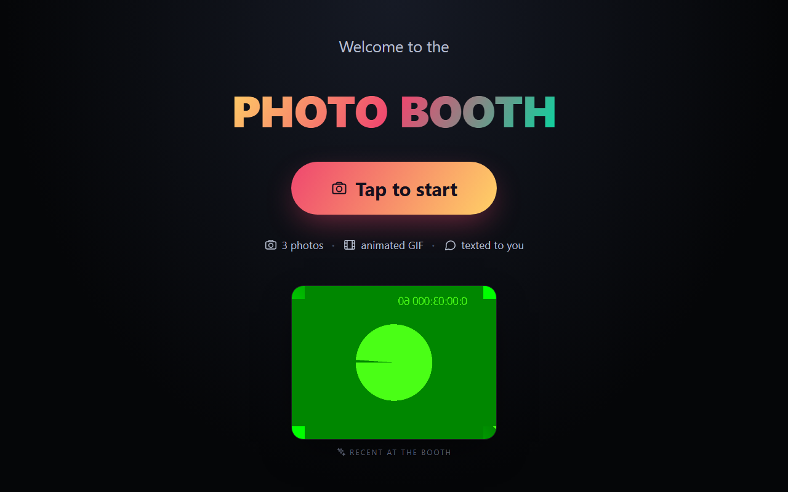
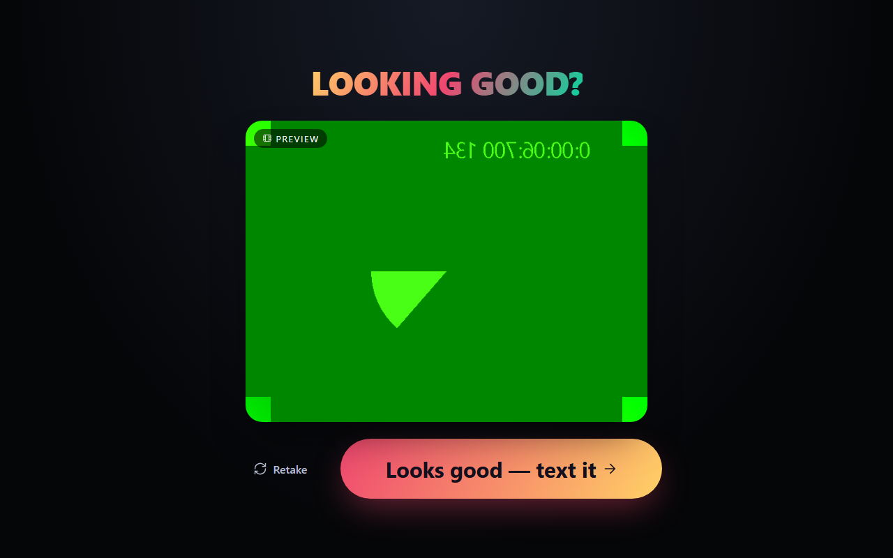
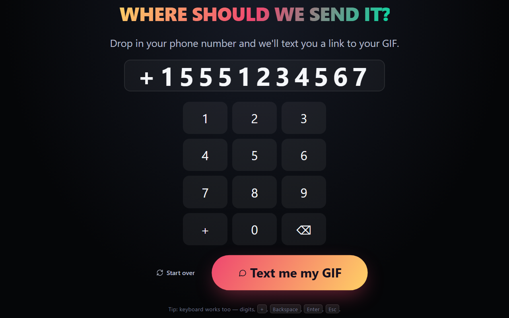
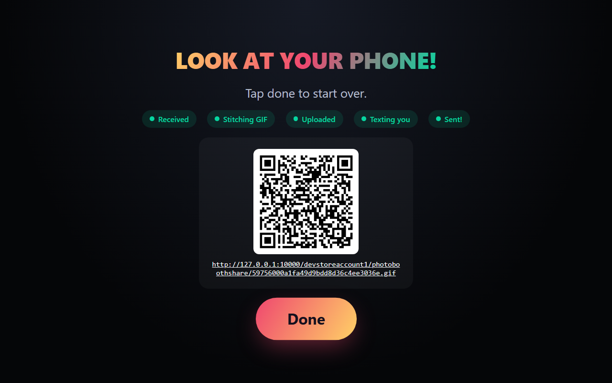
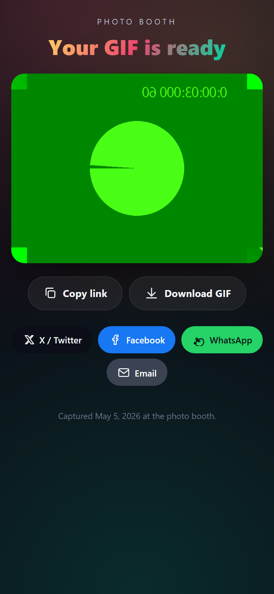
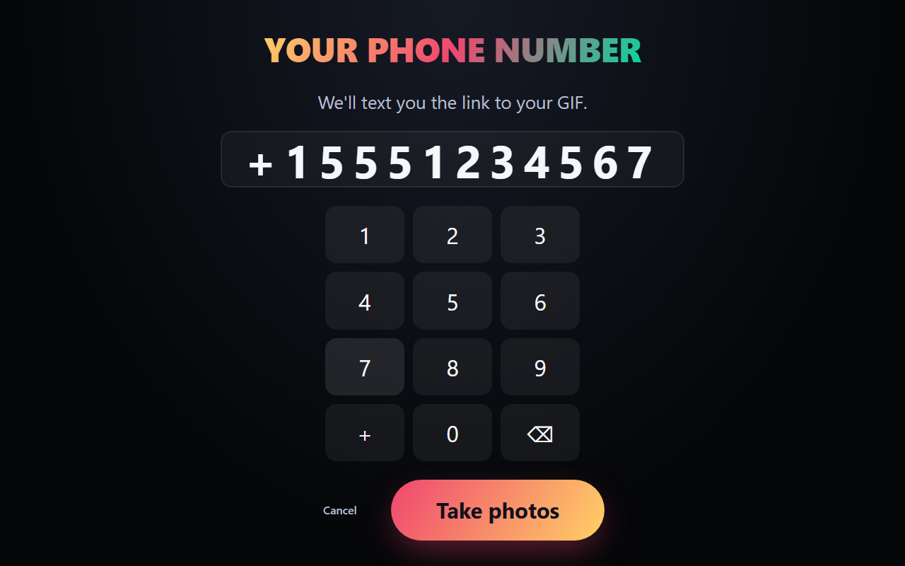
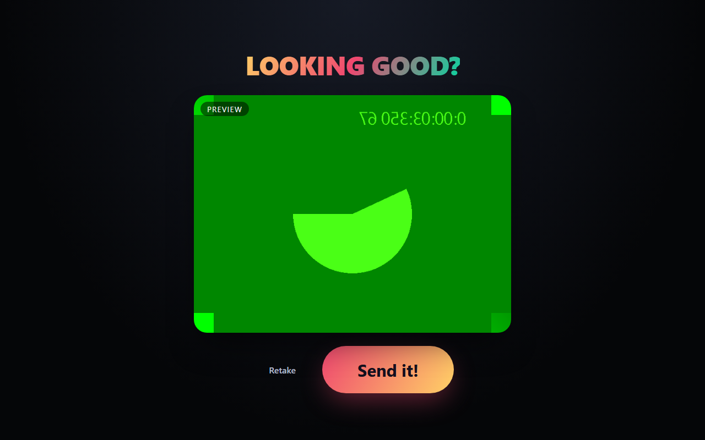

# photo-booth

Modern rebuild of [`IEvangelist/IEvangelist.PhotoBooth`](https://github.com/IEvangelist/IEvangelist.PhotoBooth), a kiosk-style photo booth that snaps a series of webcam frames, stitches them into an animated GIF, uploads to blob storage, and SMS-es the share link.

The 2018 original was a single ASP.NET Core 2.1 + Angular 5 process. This rebuild splits it across modern, observable, distributed components orchestrated by **.NET Aspire**.

## Highlights

- **Angular 20 kiosk** with standalone components, signals, inline SVG icons, and a rotating gallery of recent captures.
- **.NET 10 minimal API** with built-in OpenAPI + a kiosk-themed [Scalar](https://scalar.com) reference UI at `/scalar`.
- **Azure Functions v4 (Node TS)** for queue-driven GIF stitching and pluggable SMS dispatch (ACS / Twilio / Log).
- **First-class Aspire Azure Storage** (Azurite emulator) — Blob + Queue + Table — with `addBlobs` / `addQueues` / `addTables` references injected into every consumer.
- **OpenTelemetry** end-to-end — API + Functions both emit traces/metrics to the Aspire dashboard via OTLP.
- **Public per-capture share page** at `/g/:captureId` with native Web Share API, copy-link, and X / Facebook / WhatsApp / Email buttons. The SMS link points here so recipients land on a clean, shareable page (not a raw blob URL).

## Kiosk flow

| 1. Idle (with rotating gallery) | 2. Camera (3× countdown) | 3. Preview |
|---|---|---|
|  |  |  |

| 4. Phone entry (after capture) | 5. Share (QR + GIF + landing link) | 6. Public landing page |
|---|---|---|
|  |  |  |

The phone number prompt comes **after** the photos so the subject sees their GIF before handing over any PII. The kiosk shows the same QR code and landing URL that recipients receive over SMS, and the per-capture landing page (mobile-first) gives recipients native share + copy + per-platform share buttons.

## Architecture

```
[Angular kiosk] ──HTTP──▶ [API (.NET 10)] ──Queue──▶ [stitch-gif Function] ──Queue──▶ [dispatch-sms Function]
       ▲                       │  ▲                            │                              │
       └──── SignalR ──────────┘  └──── webhook ───────────────┴──── webhook ─────────────────┘
                                              │
                                       [Azurite: Blob + Queue + Table]
```

- **Angular kiosk** captures frames via `getUserMedia`, runs the per-photo countdown UX, then collects the recipient's number and posts frames + phone to the API.
- **ASP.NET Core minimal API** stores frames in Azurite Blob, writes capture metadata to a Table, enqueues `stitch-requests`, and exposes a SignalR `StatusHub` for live progress and a `GET /api/gallery` endpoint that powers the idle-screen carousel. OpenAPI is exposed at `/openapi/v1.json`; Scalar UI at `/scalar`.
- **`stitch-gif` Function** (Node TS) decodes PNGs, encodes the animated GIF, uploads to a public-blob share container, computes the public landing URL (`{BOOTH_PUBLIC_URL}/g/{captureId}`), postbacks `uploaded` to the API, and enqueues `sms-requests`.
- **`dispatch-sms` Function** (Node TS) fans out to a pluggable SMS provider (ACS / Twilio / Log) using the landing URL as the SMS body, and postbacks `sent` / `sms_failed`.
- **Azurite** simulates Azure Storage locally, fully managed by Aspire.

See [`AGENTS.md`](./AGENTS.md) for the run commands, conventions, and full status flow.

## The flow

A complete capture, end-to-end against the local Aspire stack (Chromium with a fake webcam — Chromium's built-in moving test pattern — drives the Angular kiosk through Playwright):

| Step | Screen |
|---|---|
| **1. Idle.** Booth waits, pulsing the start button. Options (`photosToTake`, `frameDelay`, …) are fetched up front. |  |
| **2. Number pad.** Customer punches in an E.164 phone number; client-side regex unlocks `Take photos`. |  |
| **3. Camera + countdown.** Mirrored video feed, big yellow countdown overlay, snaps `photosToTake` frames spaced by `frameDelay`. |  |
| **4. Preview.** Captured frames cycle so the customer can sanity-check before posting; `Retake` re-runs `/capture`, `Send it!` posts to the API. |  |
| **5. Share.** Five live status pills (`Received` → `Stitching GIF` → `Uploaded` → `Texting you` → `Sent!`) update over SignalR, with the QR code resolving to the GIF served from Azurite. |  |

## Prerequisites

- .NET **10** SDK
- Node **20+**
- [Aspire CLI](https://aspire.dev) (`aspire --version` ≥ 13.3)
- Azure Functions Core Tools v4 (`func --version`)
- Docker (for the Azurite container)

## Quickstart

```powershell
# From the repo root
npm install
dotnet restore .\apps\api\PhotoBooth.Api.csproj
npm --prefix .\apps\functions install
npm --prefix .\apps\web install

aspire start
```

Open the Aspire dashboard URL printed by the CLI, then click through to:

- the kiosk SPA (`http://localhost:4200`)
- the API's Scalar reference UI (`http://localhost:5125/scalar`)
- the dashboard's **Traces** and **Metrics** tabs to see OTel data flowing from `photo-booth-api` (and, when the local OTLP cert handshake succeeds, `photo-booth-functions`)

## Configuration

| Env / parameter | Purpose | Default |
|---|---|---|
| `SMS_PROVIDER` | `acs` \| `twilio` \| `log` | `log` |
| `INTERNAL_WEBHOOK_SECRET` | Shared secret for Function → API webhook | generated by Aspire |
| `BOOTH_PUBLIC_URL` | Public origin used to build the landing-page URL texted to the recipient | `http://localhost:4200` |
| `ACS_CONNECTION_STRING` | Azure Communication Services connection string | (unset) |
| `ACS_FROM_PHONE` | E.164 number provisioned in ACS | (unset) |
| `TWILIO_ACCOUNT_SID` / `TWILIO_AUTH_TOKEN` / `TWILIO_FROM_PHONE` | Twilio creds | (unset) |
| `BoothOptions__PhotosToTake` etc. | Capture/stitch tuning | see `appsettings.json` |

The default `SMS_PROVIDER=log` means you can run the full flow end-to-end with **zero** SMS credentials — the dispatch Function just logs the share URL.

## Observability

OpenTelemetry is wired into both services:

- **API** (`photo-booth-api`) — `AspNetCore`, `HttpClient`, and `Runtime` instrumentations + OTLP exporters for traces/metrics/logs. Health and Scalar/OpenAPI endpoints are filtered out of traces to keep the dashboard signal clean.
- **Functions** (`photo-booth-functions`) — `auto-instrumentations-node` (HTTP, gRPC, etc.) + OTLP gRPC exporters. Local-dashboard delivery is best-effort under Aspire's self-signed dev cert; spans are still produced and will flow to a properly-trusted collector in deployed environments.

## License

MIT (matches the original repo).

